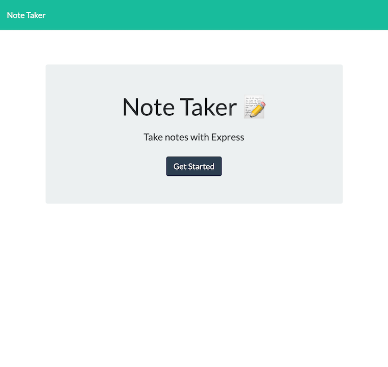
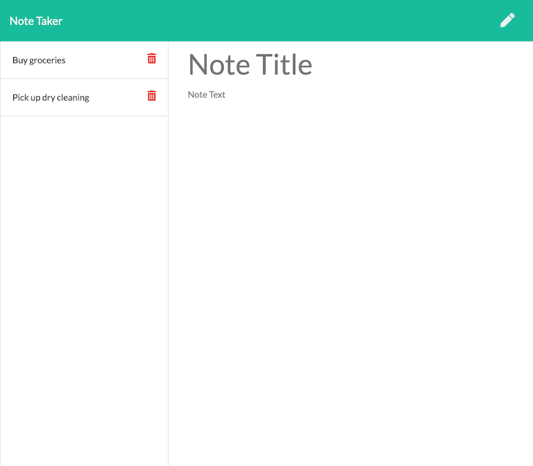
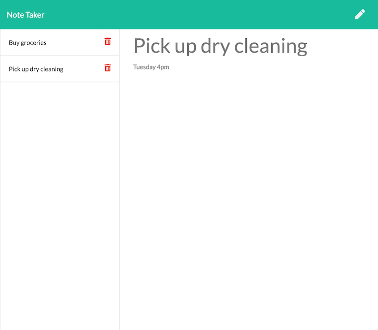
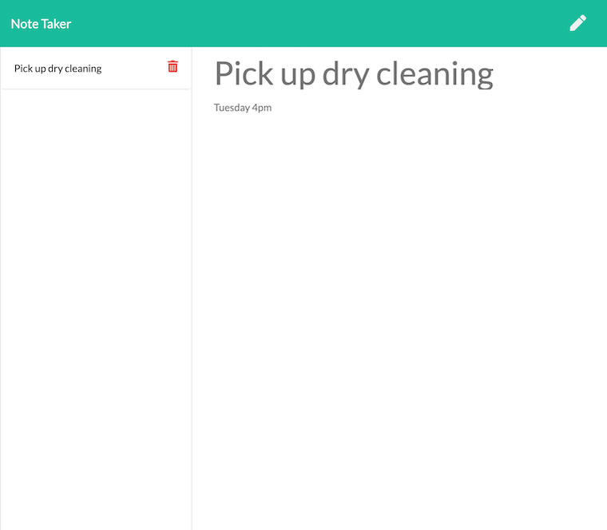

# N0te Keepr

## Description
This application allows users to create new notes to keep track of things needed to be accomplished. The application also allows for users to delete notes.

## URL
https://n0tekeepr.herokuapp.com/

The repository can be found [here](https://github.com/lacey-griffith/miniature-eureka)

## Contributing
Starter code provided by the Bootcamp, back end server code written by Lacey Griffith.

## Questions
If you have questions or would like to contact me about this project, please email me at lacey.griffith04@gmail.com.

## Site Images

